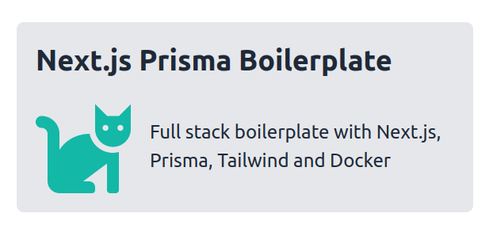

# Next.js Prisma Boilerplate

- logo, badges, gif, description

## Demo

- live, Gitpod playground

## Screenshots

## How to use this

## Features

### Motivation

## Tech stack

## Docs

## Contributing

## Table of contents

## Installation (Dev environments)

- local, Docker, devcontainers, Gitpod

## Next.js (frontend)

## next-auth

## Next.js (api)

## Database (Prisma)

## Data fetching (React Query)

## Forms

## Styling (TailwindCSS)

## Themes

## Testing

### Testing (frontend)

### Testing (api)

### Testing (coverage)

## E2E testing (Cypress)

## Docker

## Postgres

## CI/CD (Github Actions)

## Deployment (Traefik)

## Known issues

## References

## License
