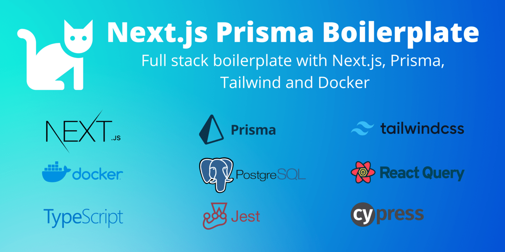

# Next.js Prisma Boilerplate

<!-- logo, badges, gif, description, mobile screenshots -->

This is full stack boilerplate built around latest Next.js stack. It is composed of the best practices described in official docs combined with my decisions derived from my own experience and knowledge that I have gathered from working with other people.

Don't spend next 3 months making architectural decisions, choosing libraries, setting up development environments and CI/CD pipelines, writing boilerplate code, _instead install this boilerplate in 15 minutes and start working on your features **today**._

Here you can find all fundamental decisions for an app already made for you:

- **frontend architecture** - pages, layouts, views, components, hooks, authentication, styling, theming, data fetching, state management, error handling, forms and validation
- **backend architecture** - controller and service layers, interaction with database, authentication, error handling in both API and getServerSideProps, validation, file uploads and serving
-
- **test configuration** -

## Demo

 <!-- live, Gitpod playground -->

## Screenshots

#### Desktop screen:

https://user-images.githubusercontent.com/9990165/177367837-a2692e5d-b694-454e-806d-21e806465836.mp4

## How to use this

There is a lot of talk, and buzz around JavaScript frameworks, a lot of theory, tutorials, opinions... but lets actually take what we read in documentations and check how it works in practice and see if we can build something useful and meaningful with it.

## Features

### Motivation

## Tech stack

## Docs

## Table of contents

## Installation (Dev environments)

- local, Docker, devcontainers, Gitpod

## Next.js (frontend)

## next-auth

## Next.js (api)

## Database (Prisma)

## Data fetching (React Query)

## Forms

## Styling (TailwindCSS)

## Themes

## Testing

### Testing (frontend)

### Testing (api)

### Testing (coverage)

## E2E testing (Cypress)

## Docker

## Postgres

## CI/CD (Github Actions)

## Deployment (Traefik)

## Known issues

## References

## Contributing

## License
